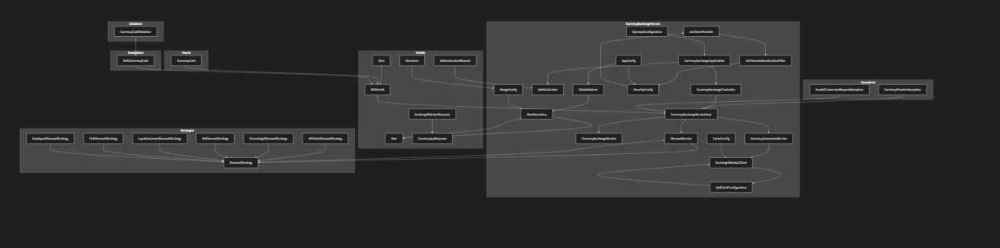

# Currency Exchange Service

This is a currency exchange service application that calculates payable amounts after applying discounts and converting currencies using real-time exchange rates.

## Prerequisites

- Java 21
- Maven
- MongoDB

## Running the Application

To run the application, use the following command:

```bash
mvn spring-boot:run


mvn test -Punit-tests

